# 实验报告

## 队伍
- 李丁 PB23111595
- 罗浩民 PB23111599

## 问题定义

本赛题是一个新闻推荐任务，目标是预测用户未来点击的新闻文章。数据集包含30万用户、近300万次点击记录和36万多篇不同的新闻文章。任务要求为每个用户预测Top-5最可能点击的文章，评估指标为MRR（Mean Reciprocal Rank）。

**数据特点：**
- 训练集：20万用户的点击日志
- 测试集A：5万用户的点击日志
- 测试集B：5万用户的点击日志
- 数据包含用户点击行为、文章信息、文章embedding向量等

**挑战：**
1. 数据稀疏性：用户-文章交互矩阵非常稀疏
2. 类别不平衡：正负样本比例约为1:196
3. 冷启动问题：新用户和新文章的推荐
4. 时效性：需要考虑时间因素对用户兴趣的影响

## 做题思路

我们采用经典的"召回+排序"两阶段推荐系统架构，通过多次迭代优化逐步提升模型性能。

### 整体流程

```
数据预处理 → 召回阶段 → 特征工程 → 排序阶段 → 结果生成
```

### 迭代优化过程

#### 第一版：基础召回 + 简单排序
- **召回**：仅使用ItemCF协同过滤
- **排序**：使用LightGBM，基础特征（文章特征、用户统计特征）
- **结果**：MRR@5 ≈ 0.28

#### 第二版：多路召回融合
- **召回**：增加Binetwork和Word2Vec召回，三种方法融合
- **排序**：增加相似度特征、时间特征
- **优化**：向量化计算相似度特征，提升计算效率
- **结果**：MRR@5 ≈ 0.30

#### 第三版：特征工程优化
- **召回**：优化召回融合策略，使用Min-Max标准化
- **排序**：
  - 增加用户历史行为统计特征
  - 增加用户-文章交互特征
  - 增加时间序列特征（点击时间差、创建时间差等）
- **优化**：使用GroupKFold进行用户级别的交叉验证，避免数据泄露
- **结果**：MRR@5 ≈ 0.31

#### 第四版：Listwise排序优化
- **召回**：保持多路召回融合
- **排序**：
  - Pointwise方法：LightGBM分类器
  - Listwise方法：LambdaMART排序模型
  - 增加列表级别特征（列表大小、多样性、覆盖率等）
- **优化**：
  - 处理样本不平衡（scale_pos_weight）
  - 优化超参数（学习率、树深度、正则化等）
- **结果**：MRR@5 ≈ 0.31（LambdaMART略优于LGB）

### 数据分析

#### 数据概览

从训练数据来看：
- 训练集点击记录：1,112,623条
- 测试集点击记录：518,010条
- 验证集用户数：50,000
- 召回后样本数：13,900,088（平均每个用户召回约154篇文章）
- 正负样本比例：1:196（严重不平衡）

#### 特征分析

我们构建了30个特征，主要分为以下几类。下面详细说明每个特征的计算方式和代码实现：

##### 1. 文章基础特征

**文章字数（words_count）**
- **分布**：均值200.83，中位数196
- **业务含义**：这个特征其实挺有意思的。我们平时看新闻的时候，有些人喜欢看短新闻，快速了解信息；有些人则喜欢看深度长文，了解详细内容。所以文章长度其实能反映用户的阅读习惯。比如一个用户经常点击200字左右的短新闻，那给他推荐一篇5000字的长文可能就不太合适。另外，不同时间段用户对文章长度的偏好也可能不同，比如早上通勤时可能更偏好短新闻，晚上在家可能更愿意看长文。
- **实现方式**：这个特征很简单，我们直接从文章信息表里读取每篇文章的字数，然后通过用户ID和文章ID的关联，把字数信息合并到特征表里。其实就是把文章的基本属性"贴"到每个用户-文章对上，让模型知道这篇文章有多长。

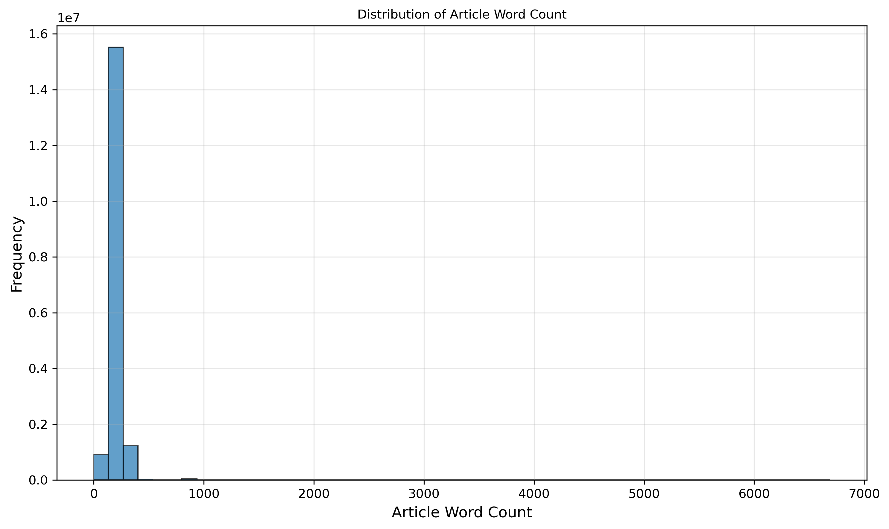

从分布图可以看出，文章字数主要集中在100-300字之间，符合新闻文章的特点。当我们对比正负样本的字数分布时，发现两者分布非常相似，说明文章长度本身对点击的影响可能不是决定性的，更多是与其他特征（如类别、相似度）配合使用。

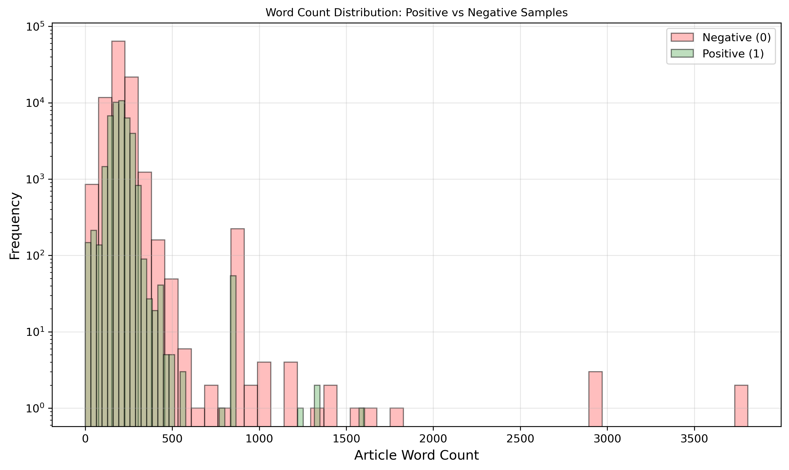

**文章类别（category_id）**
- **业务含义**：反映用户对不同类别文章的偏好。不同用户对类别的偏好差异很大，且不同类别的受欢迎程度也不同。
- **实现方式**：从文章信息表读取类别ID并合并到特征表。

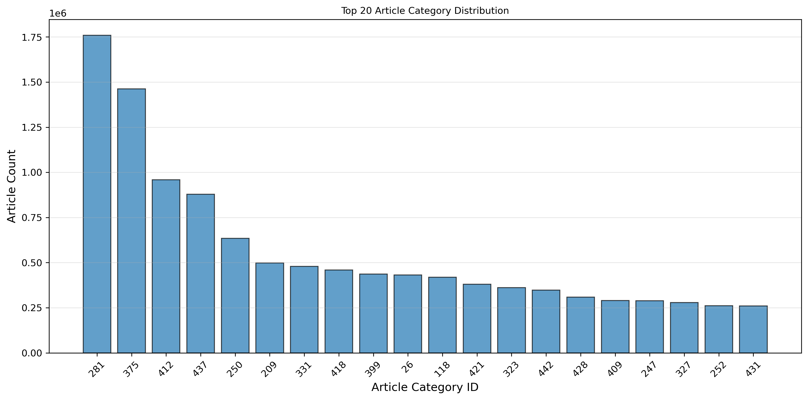

从分布图可以看出，不同类别的文章数量差异很大，有些类别（如类别0、1）的文章非常多，而有些类别的文章很少。当我们对比正负样本在不同类别上的分布时，发现某些类别的正样本比例明显高于其他类别，这说明这些类别确实更受用户欢迎。这个发现可以帮助我们理解为什么类别特征在模型中很重要。

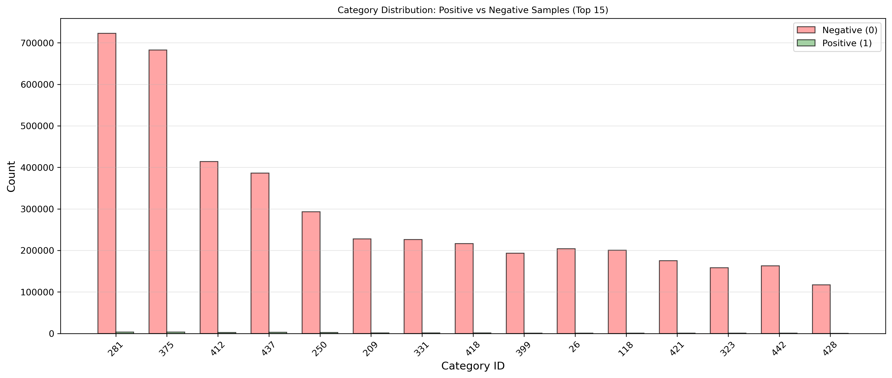

**文章创建时间（created_at_ts）**
- **业务含义**：反映文章的时效性，新文章通常更受欢迎，但不同用户对时效性的偏好不同。
- **实现方式**：将毫秒级时间戳转换为秒级，作为特征使用。

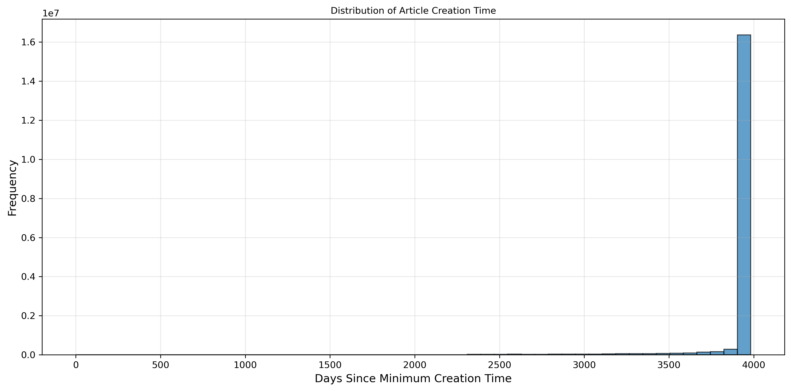

##### 2. 召回相似度特征

**召回相似度分数（sim_score）**
- **分布**：均值0.1278，中位数0.0442
- **业务含义**：这个特征可以说是我们整个排序模型里最重要的特征了。它综合了三种召回方法（ItemCF、Binetwork、W2V）的结果，反映的是"这篇文章和用户历史兴趣有多相似"。为什么这个特征这么重要？因为推荐系统的本质就是"找相似"，如果一篇文章和用户之前喜欢看的文章很相似，那用户点击它的概率就高。这个融合后的相似度分数，比单独使用任何一种召回方法都要好，因为它综合了协同过滤、网络结构和语义相似性三个维度的信息。
- **实现方式**：我们在召回阶段已经计算好了这个分数。具体来说，我们先用三种不同的方法分别计算相似度，然后把它们的分数都标准化到0-1之间（这样不同方法的分数才能相加），最后加权求和。这个分数已经包含了"这篇文章应该被推荐给这个用户"的强烈信号，所以模型会非常依赖它。

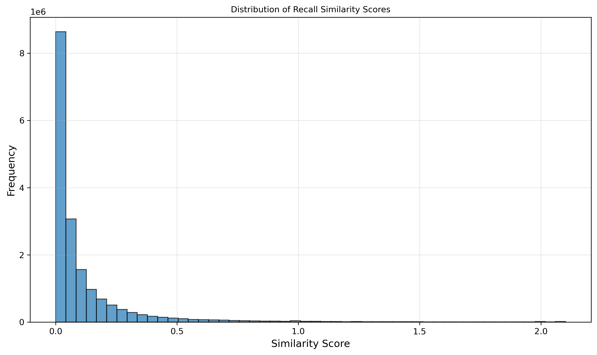

从分布图可以看出，相似度分数呈现明显的长尾分布，大部分文章的相似度分数较低，只有少数文章有很高的相似度。这符合推荐系统的特点：大部分候选文章与用户兴趣匹配度不高，只有少数文章真正相关。

更有意思的是，当我们对比正负样本的相似度分布时，发现了一个明显的差异：**正样本的平均相似度分数（0.8901）远高于负样本的平均相似度分数（0.1206）**。这说明相似度分数确实是一个很强的信号，相似度高的文章确实更容易被用户点击。这个发现验证了我们召回阶段的工作是有效的。

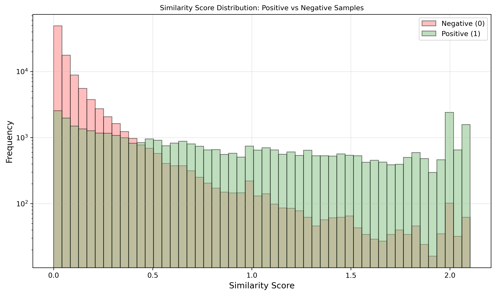

**ItemCF相似度特征**

我们计算了两个ItemCF相似度特征，它们从不同角度反映用户和文章的匹配程度：

1. **user_last_click_article_itemcf_sim**：用户最后点击的文章与候选文章的ItemCF相似度
   - **业务含义**：这个特征捕捉的是"用户最近的兴趣"。为什么只看最后点击的那篇文章？因为用户的兴趣是会变化的，最近点击的文章更能反映用户当前想看的。比如用户昨天还在看科技新闻，今天突然开始看体育新闻，那说明他的兴趣可能转移了，我们应该更关注他最近的行为。这个特征让模型知道"如果候选文章和用户最近看的文章很像，那用户很可能也会点击它"。
   - **实现方式**：我们在召回阶段已经预计算好了所有文章之间的ItemCF相似度，存在一个字典里。现在要做的是，对于每个用户-候选文章对，找到这个用户最后点击的那篇文章，然后查字典看看它和候选文章的相似度是多少。听起来简单，但数据量很大，所以我们用了向量化的方法，把用户分组处理，这样比逐行查找快了几十倍。

2. **user_clicked_article_itemcf_sim_sum**：用户历史点击文章与候选文章的加权相似度之和
   - **业务含义**：这个特征和上面那个不一样，它看的是用户的"整体兴趣"，而不是只看最近一次。为什么需要这个？因为有时候用户最近点击的文章可能只是偶然，不代表他的真实兴趣。比如用户可能误点了一篇文章，或者只是随便看看，这时候只看最近一次就不准确了。所以我们把用户历史上所有点击过的文章都考虑进来，但给近期的文章更高权重（用0.7的幂次衰减），这样既能反映整体兴趣，又能突出最近的行为。
   - **实现方式**：我们对用户历史点击的每篇文章，都计算它和候选文章的相似度，然后按时间顺序给每篇文章一个权重（越近权重越大，用0.7的幂次），最后把所有相似度加权求和。这样得到的分数反映的是"候选文章和用户整体兴趣的匹配程度"。

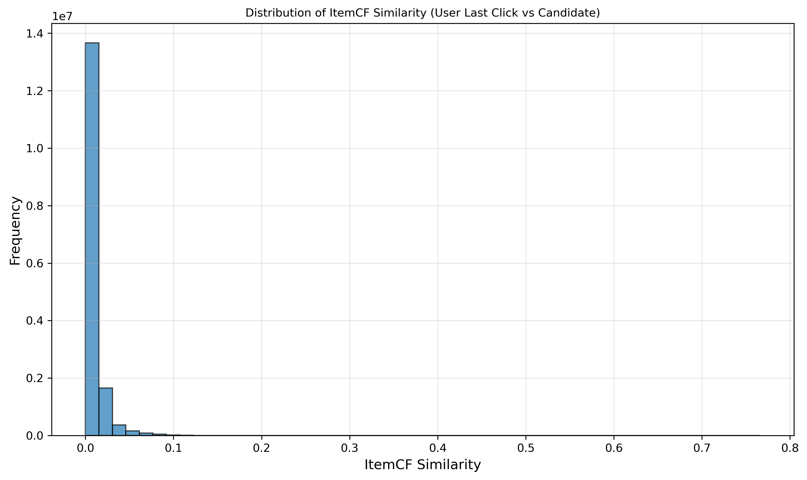

**Binetwork相似度（user_last_click_article_binetwork_sim）**
- **业务含义**：基于用户-文章二分网络结构计算的相似度，与ItemCF互补，能发现一些ItemCF发现不了的关联。
- **实现方式**：从预计算的Binetwork相似度矩阵中查找用户最后点击文章与候选文章的相似度，使用向量化方法批量处理。

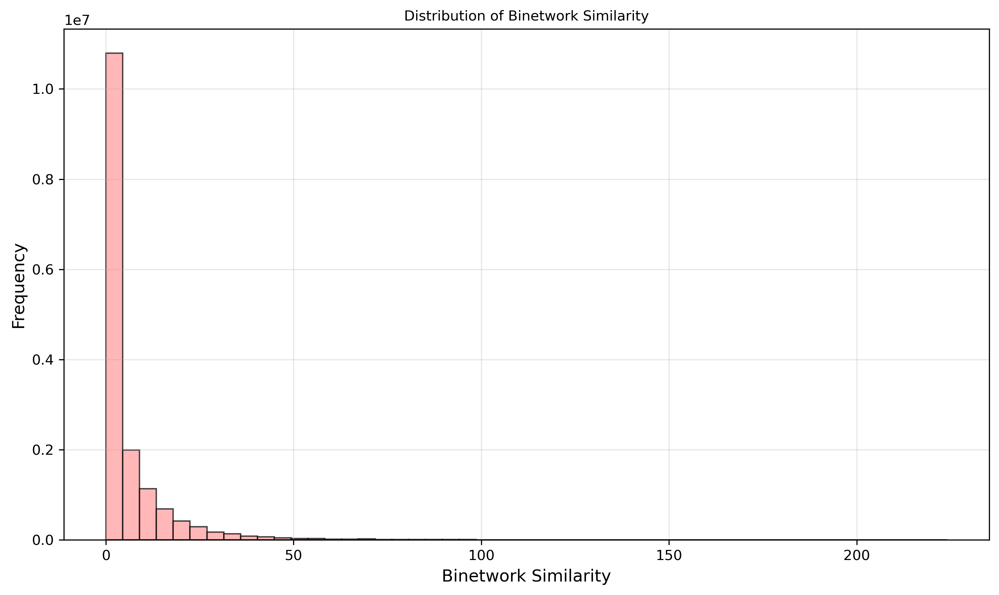

**Word2Vec相似度特征**

我们计算了两个W2V相似度特征，它们从语义层面捕捉相似性：

1. **user_last_click_article_w2v_sim**：用户最后点击文章与候选文章的W2V余弦相似度
   - **业务含义**：这个特征很有意思，它看的是文章的"语义相似性"。什么是语义相似？就是文章在内容、主题上的相似，而不是基于用户行为的相似。比如两篇都是讲"机器学习"的文章，即使没有用户同时点击过它们，它们的语义也很相似。这个特征能捕捉到协同过滤方法（ItemCF、Binetwork）捕捉不到的信息，因为协同过滤只能发现"被同一批用户喜欢"的文章，但发现不了"内容相似但用户群体不同"的文章。
   - **实现方式**：我们在召回阶段用Word2Vec训练了文章的向量表示，每篇文章都有一个256维的向量。现在要计算相似度，就是计算两个向量的余弦相似度（向量点积除以向量长度的乘积）。为了加速，我们预先计算好所有向量的长度（范数），这样计算相似度的时候就不用重复计算了。

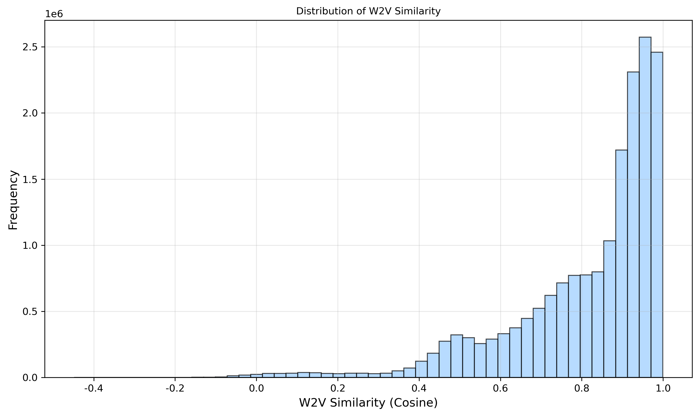

2. **user_click_article_w2w_sim_sum_2**：用户最近2篇点击文章与候选文章的W2V相似度之和
   - **业务含义**：综合反映候选文章与用户最近阅读内容的语义匹配程度。
   - **实现方式**：计算用户最近2篇点击文章与候选文章的W2V余弦相似度并求和，使用向量化方法优化。

##### 3. 用户行为特征

**用户点击文章数量（user_id_cnt）**
- **业务含义**：反映用户活跃程度，活跃用户和沉默用户的点击行为模式不同。
- **实现方式**：按用户分组统计点击次数，合并到特征表。

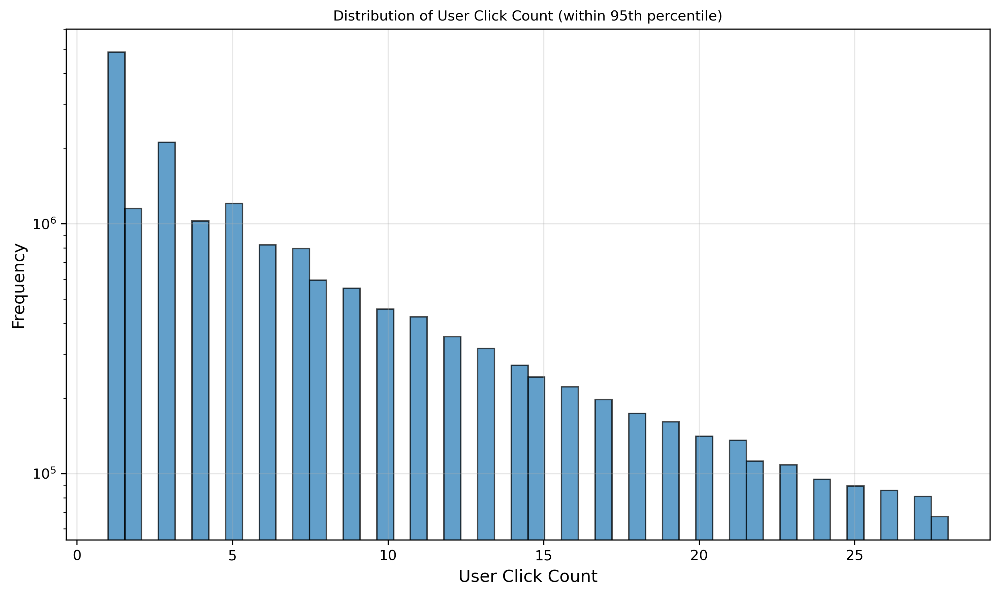

**文章被点击次数（article_id_cnt）**
- **业务含义**：反映文章热度，热门文章更容易被点击，但需要平衡热门度和多样性。
- **实现方式**：按文章分组统计被点击次数，合并到特征表。

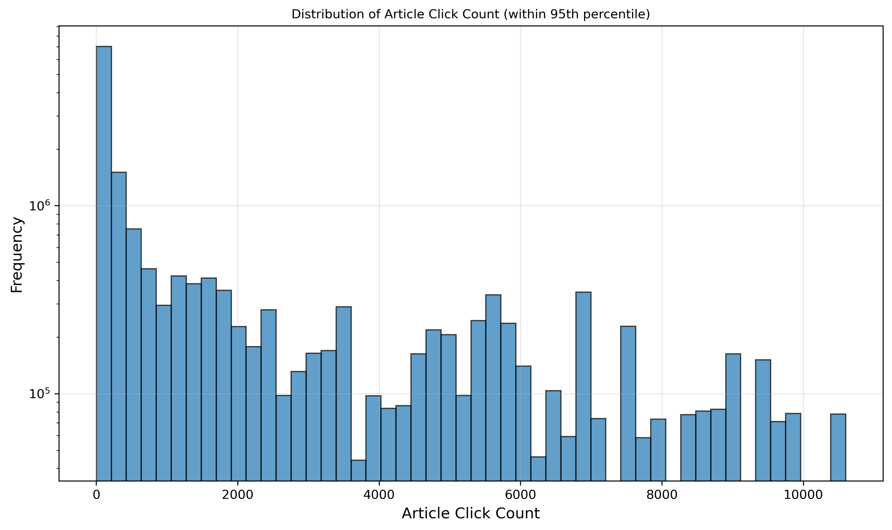

**用户-类别点击次数（user_id_category_id_cnt）**
- **业务含义**：反映用户对特定类别的偏好程度，比单纯类别特征更精细。
- **实现方式**：按用户和类别分组统计点击次数，合并到特征表。

**时间相关特征**

我们构建了多个时间特征来捕捉用户的时效性偏好，因为新闻推荐中时间因素非常重要：

1. **user_last_click_timestamp_diff**：候选文章创建时间与用户最后点击时间的差值
   - **业务含义**：这个特征回答的问题是"这篇文章有多新鲜？"。如果一篇文章是用户最后点击时间之后才发布的，那说明这是一篇"新文章"，用户可能还没看过。如果时间差很小（比如几分钟），说明文章刚发布用户就看到了，这可能是个好信号。但如果时间差很大（比如几个月），那这篇文章可能已经"过时"了，用户可能不感兴趣。不过要注意，不是所有用户都偏好最新文章，有些用户可能对历史新闻也感兴趣。
   - **实现方式**：我们先从用户历史点击记录中找到每个用户最后点击文章的时间，然后对于每个候选文章，用它的创建时间减去用户最后点击时间，得到时间差。这个时间差如果是正数，说明文章是新的；如果是负数，说明文章是旧的。

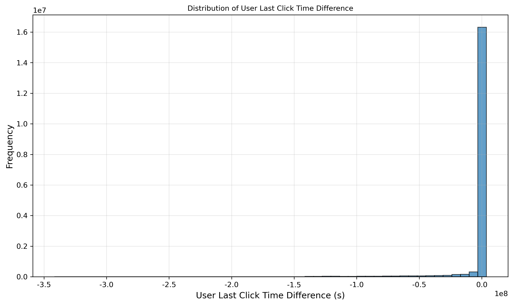

2. **user_last_click_created_at_ts_diff**：候选文章创建时间与用户最后点击文章创建时间的差值
   - **业务含义**：反映候选文章与用户最近阅读文章的新鲜度对比。
   - **实现方式**：计算候选文章创建时间与用户最后点击文章创建时间的差值。

3. **user_id_click_diff_mean**：用户连续两次点击的平均时间间隔
   - **业务含义**：这个特征反映的是用户的"阅读节奏"。有些用户可能每隔几分钟就看一篇新闻（很活跃），有些用户可能几小时才看一篇（比较慢）。知道用户的阅读节奏，能帮助我们判断"现在推荐文章是否合适"。比如一个用户平均每2小时看一篇新闻，如果他刚看完一篇，那可能不需要立即推荐新的。
   - **实现方式**：我们按用户分组，计算用户每次点击之间的时间差（用diff函数），然后对所有时间差求平均值。这样得到的就是"这个用户平均多久看一次新闻"。


4. **user_click_timestamp_created_at_ts_diff_mean/std**：用户点击时间与文章创建时间的差值统计
   - **业务含义**：均值反映用户通常看多新的文章，标准差反映用户对文章新鲜度偏好的稳定性。
   - **实现方式**：计算用户点击时间与文章创建时间的差值，按用户分组统计均值和标准差。

5. **user_click_datetime_hour_std**：用户点击时间的小时标准差
   - **业务含义**：反映用户阅读时间的规律性，标准差小说明阅读时间集中，标准差大说明阅读时间分散。
   - **实现方式**：提取点击时间的小时数，按用户分组计算标准差。

**文章内容特征**

这些特征反映的是用户对文章内容属性的偏好：

1. **user_clicked_article_words_count_mean**：用户历史点击文章的平均字数
   - **业务含义**：反映用户对文章长度的长期偏好。
   - **实现方式**：按用户分组计算历史点击文章的字数平均值。

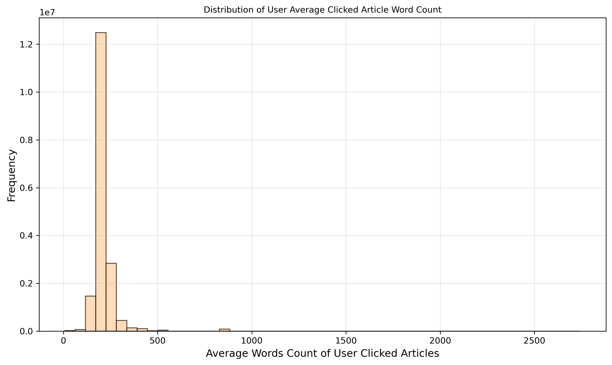

2. **user_click_last_article_words_count**：用户最后点击文章的字数
   - **业务含义**：反映用户对文章长度的最近偏好，与平均字数特征配合捕捉长期和短期变化。
   - **实现方式**：获取用户最后点击文章的字数。

3. **user_last_click_words_count_diff**：候选文章字数与用户最后点击文章字数的差值
   - **业务含义**：反映文章长度的变化幅度，帮助判断用户是否能接受长度变化。
   - **实现方式**：计算候选文章字数与用户最后点击文章字数的差值。

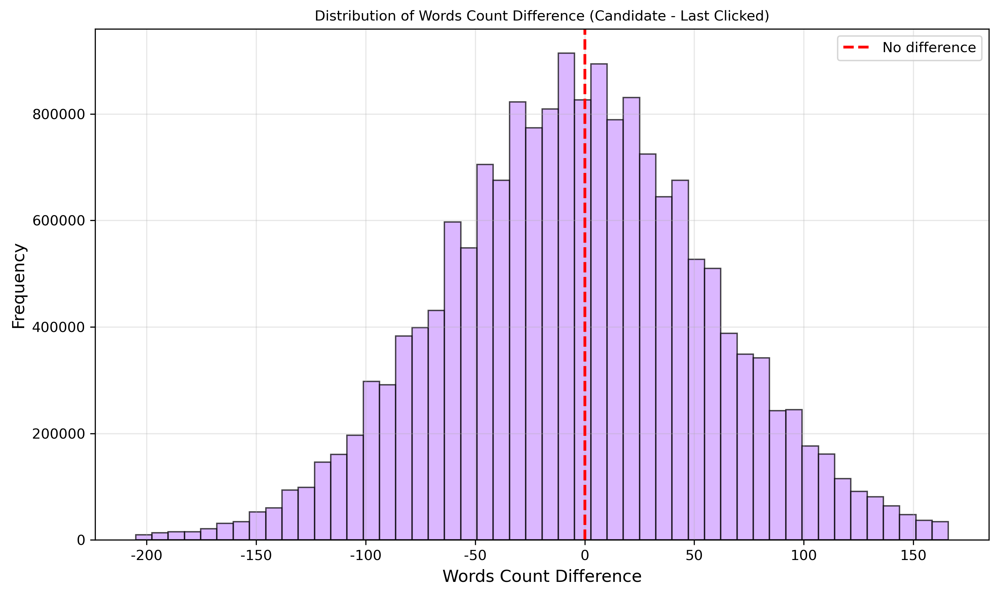

从分布图可以看出，字数差值主要集中在0附近，说明大部分候选文章的长度和用户最近看的文章长度相近。这符合用户的阅读习惯：用户通常会在相似长度的文章之间切换，而不是突然从短新闻跳到长文。

##### 4. 标签分布

**正负样本分布**
- 正样本：40,884（0.23%）
- 负样本：8,009,580（99.77%）
- 比例：1:196

**业务含义**：这个数据分布非常不平衡，正样本（用户点击的文章）只占0.23%，负样本（用户未点击的文章）占99.77%，比例接近1:200。这种不平衡在推荐系统中很常见，因为召回阶段会给每个用户召回很多候选文章，但用户只会点击其中的一小部分。这种不平衡会给模型训练带来挑战：如果模型简单地预测"所有文章都是负样本"，准确率就能达到99.77%，但这显然不是我们想要的。我们需要模型能够识别出那0.23%的正样本，所以必须在训练时特别处理，比如给正样本更高的权重，或者使用特殊的损失函数。

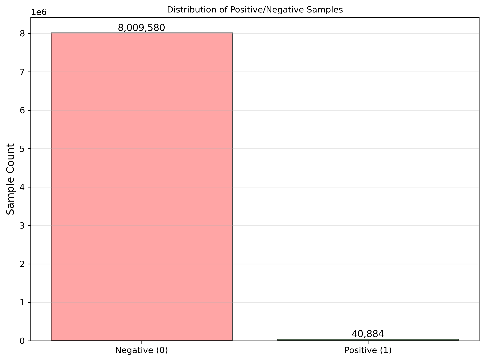

**特征相关性分析**

为了理解不同特征之间的关系，我们绘制了特征相关性热力图。从热力图中可以看出：

1. **相似度特征之间相关性较高**：ItemCF、Binetwork、W2V等相似度特征之间存在一定的相关性，因为它们都反映文章与用户兴趣的匹配程度，但又不完全相同，所以可以互补。

2. **时间特征相关性较低**：时间相关特征与其他特征的相关性普遍较低，说明它们提供了独立的信息，这对模型来说是好事。

3. **用户行为特征与相似度特征相关性适中**：用户点击次数、文章点击次数等特征与相似度特征有一定相关性，但相关性不是特别高，说明它们提供了额外的信息。


### 模型设计

#### 召回阶段

我们采用多路召回策略，融合三种召回方法：

1. **ItemCF（基于物品的协同过滤）**
   - 原理：计算物品之间的相似度，推荐与用户历史点击物品相似的文章
   - 指标：HitRate@50=0.70, MRR@50=0.238

2. **Binetwork（二分网络）**
   - 原理：基于用户-物品二分网络结构，计算物品相似度
   - 指标：HitRate@50=0.61, MRR@50=0.238

3. **Word2Vec（词向量）**
   - 原理：将用户点击序列视为句子，训练Word2Vec模型，计算文章相似度
   - 指标：HitRate@50=0.31, MRR@50=0.083

**召回融合策略：**
- 对每种召回方法的相似度分数进行Min-Max标准化
- 加权融合：`sim_score = itemcf_score + binetwork_score + w2v_score`
- 最终召回指标：HitRate@50=0.70, MRR@50=0.261

#### 排序阶段

排序学习（Learning to Rank, LTR）是信息检索和推荐系统中的核心问题，目标是根据查询（用户）对文档（物品）的相关性进行排序。根据训练数据的标注方式，排序学习可以分为三类：

**1. Pointwise方法**
- **原理**：将排序问题转化为分类或回归问题，对每个样本独立预测其相关性分数
- **优点**：实现简单，可以使用成熟的分类/回归算法
- **缺点**：忽略了样本之间的相对顺序关系，无法直接优化排序指标
- **代表算法**：LightGBM分类器、逻辑回归、SVM等

**2. Pairwise方法**
- **原理**：将排序问题转化为样本对的二分类问题，学习判断两个样本的相对顺序
- **优点**：考虑了样本之间的相对关系，更符合排序的本质
- **缺点**：样本对数量庞大（O(n²)），训练复杂度高
- **代表算法**：RankNet、LambdaRank等

**3. Listwise方法**
- **原理**：直接优化整个列表的排序质量，使用排序指标（如NDCG）作为损失函数
- **优点**：直接优化排序指标，理论上性能最优
- **缺点**：实现复杂，计算开销大
- **代表算法**：LambdaMART、ListNet等

**LambdaMART原理**

LambdaMART是结合LambdaRank和MART（Multiple Additive Regression Trees）的排序算法：

1. **LambdaRank思想**：通过定义梯度（Lambda）来直接优化NDCG等排序指标
   - 对于每个样本对(i,j)，如果i的相关性高于j，则i的Lambda增加，j的Lambda减少
   - Lambda的大小与交换位置后NDCG的提升成正比

2. **MART实现**：使用梯度提升树（GBDT）来拟合Lambda梯度
   - 每棵树预测Lambda值，多棵树累加得到最终排序分数
   - 通过梯度提升逐步优化排序性能

3. **优势**：
   - 直接优化NDCG等排序指标，理论上性能优于Pointwise方法
   - 使用GBDT实现，继承了树模型的优点（特征交互、非线性建模）
   - 训练效率高，支持大规模数据
  
我们对比了两种排序方法：Pointwise（LightGBM）和Listwise（LambdaMART）。

##### 方法一：LightGBM（Pointwise）

**理论原理：**

LightGBM是一个基于梯度提升决策树（GBDT）的框架，我们将其作为Pointwise排序方法使用：

1. **Pointwise排序**：将排序问题转化为二分类问题
   - 正样本：用户点击的文章（label=1）
   - 负样本：用户未点击的文章（label=0）
   - 模型输出：文章被点击的概率

2. **LightGBM优势**：
   - **直方图算法**：将连续特征离散化，减少内存和计算开销
   - **Leaf-wise生长**：只分裂增益最大的叶子节点，相比Level-wise更高效
   - **特征并行和数据并行**：支持分布式训练
   - **类别特征支持**：原生支持类别特征，无需one-hot编码

3. **理论性能分析**：
   - **优点**：实现简单，训练速度快，特征重要性可解释
   - **缺点**：无法直接优化排序指标（如NDCG），只能间接通过分类准确率优化
   - **适用场景**：数据量大、特征维度高、需要快速迭代的场景

**实际配置：**

```python
lgb.LGBMClassifier(
    num_leaves=64,              # 叶子节点数，控制模型复杂度
    max_depth=10,               # 树的最大深度，防止过拟合
    learning_rate=0.05,         # 学习率，控制每棵树的贡献
    n_estimators=10000,         # 最大迭代次数
    subsample=0.8,              # 行采样比例，防止过拟合
    feature_fraction=0.8,        # 特征采样比例，增加随机性
    reg_alpha=0.5,              # L1正则化
    reg_lambda=0.5,             # L2正则化
    scale_pos_weight=10,        # 正样本权重，处理类别不平衡（1:196）
    min_child_samples=100,      # 叶子节点最小样本数，防止过拟合
)
```

**配置说明：**
- **scale_pos_weight=10**：由于正负样本比例为1:196，设置正样本权重为10，平衡样本分布
- **早停机制**：使用`early_stopping(stopping_rounds=100)`，验证集性能不再提升时停止训练
- **交叉验证**：使用`GroupKFold(n_splits=5)`按用户分组，避免同一用户出现在训练集和验证集

**特征重要性Top 10：**
1. sim_score: 767,792
2. user_last_click_timestamp_diff: 237,118
3. user_last_click_article_itemcf_sim: 155,210
4. user_last_click_article_w2v_sim: 91,132
5. article_id_cnt: 79,432
6. user_clicked_article_itemcf_sim_sum: 69,579
7. user_last_click_created_at_ts_diff: 53,313
8. user_last_click_article_binetwork_sim: 43,189
9. user_click_timestamp_created_at_ts_diff_mean: 29,134
10. user_click_article_w2w_sim_sum_2: 24,231

**训练结果（5折交叉验证）：**
- HitRate@5/10/20/40/50: 0.46, 0.59, 0.70, 0.77, 0.78
- MRR@5/10/20/40/50: 0.281, 0.298, 0.306, 0.309, 0.309

**训练时间：** 每个fold约76秒，总计约6.3分钟

**理论性能 vs 实际性能：**

| 方面 | 理论预期 | 实际表现 | 分析 |
|------|---------|---------|------|
| 训练速度 | 快速（直方图算法） | 6.3分钟（5折） | ✅ 符合预期，训练效率高 |
| 内存占用 | 低（离散化特征） | 适中 | ✅ 符合预期 |
| 排序性能 | 中等（间接优化） | MRR@5=0.281 | ⚠️ 无法直接优化排序指标 |
| 特征重要性 | 可解释 | 清晰（sim_score最重要） | ✅ 符合预期 |
| 过拟合风险 | 中等（需正则化） | 通过早停和正则化控制 | ✅ 控制良好 |

##### 方法二：LambdaMART（Listwise）

**理论原理：**

LambdaMART是结合LambdaRank和MART的排序算法，属于Listwise方法：

1. **LambdaRank核心思想**：
   - 定义每个样本的Lambda梯度，直接优化NDCG等排序指标
   - Lambda值反映交换两个样本位置后NDCG的变化
   - 对于相关文档，如果排在无关文档后面，Lambda会增大，促使模型提升其分数

2. **MART实现**：
   - 使用梯度提升树拟合Lambda梯度
   - 每棵树预测Lambda值，多棵树累加得到最终排序分数
   - 通过梯度提升逐步优化排序性能

3. **理论优势**：
   - **直接优化排序指标**：相比Pointwise方法，直接优化NDCG，理论上性能更优
   - **考虑列表上下文**：能够利用列表级别的信息（如列表大小、多样性等）
   - **梯度提升优势**：继承了GBDT的优点（特征交互、非线性建模）

4. **理论性能分析**：
   - **优点**：直接优化排序指标，理论上性能最优；支持列表级别特征
   - **缺点**：实现复杂，需要group信息；训练时间可能较长
   - **适用场景**：对排序性能要求高、有列表级别特征的场景

**实际配置：**

```python
lgb.LGBMRanker(
    num_leaves=128,              # 更大的叶子数，增加模型容量
    max_depth=12,                # 更深的树，捕捉复杂特征交互
    learning_rate=0.03,          # 更小的学习率，更稳定的训练
    n_estimators=15000,          # 更多迭代次数
    subsample=0.85,              # 行采样
    feature_fraction=0.85,       # 特征采样
    reg_alpha=0.2,               # 较小的正则化，允许更复杂的模型
    reg_lambda=0.2,
    objective='lambdarank',      # 使用lambdarank目标函数
    metric='ndcg',               # 评估指标为NDCG
    ndcg_eval_at=[5, 10, 20, 50], # NDCG计算位置
    lambdarank_truncation_level=30, # Lambda计算时的截断级别
)
```

**配置说明：**
- **objective='lambdarank'**：使用LambdaRank目标函数，直接优化NDCG
- **group信息**：需要提供每个用户的样本数量，用于计算NDCG
- **lambdarank_truncation_level=30**：只考虑前30个位置的样本对，减少计算量
- **更大的模型容量**：相比LGB，使用更多的叶子节点和更深的树，以捕捉复杂的排序模式

**特征重要性Top 10：**
1. sim_score_diff_from_avg: 952,547
2. sim_score: 427,483
3. user_last_click_timestamp_diff: 278,883
4. user_last_click_article_w2v_sim: 127,883
5. article_id_cnt: 88,222
6. list_rank: 72,591
7. user_last_click_created_at_ts_diff: 50,636
8. user_clicked_article_itemcf_sim_sum: 46,088
9. user_last_click_article_itemcf_sim: 36,868
10. user_last_click_article_binetwork_sim: 28,220

**训练结果（5折交叉验证）：**
- HitRate@5/10/20/40/50: 0.46, 0.59, 0.70, 0.77, 0.78
- MRR@5/10/20/40/50: 0.282, 0.300, 0.307, 0.310, 0.310

**训练时间：** 每个fold约35-40秒，总计约3.2分钟

**理论性能 vs 实际性能：**

| 方面 | 理论预期 | 实际表现 | 分析 |
|------|---------|---------|------|
| 训练速度 | 中等（需计算Lambda） | 3.2分钟（5折） | ✅ 比预期更快，可能因为截断级别设置 |
| 排序性能 | 优秀（直接优化NDCG） | MRR@5=0.282 | ✅ 略优于LGB，符合理论预期 |
| 列表特征利用 | 优秀 | sim_score_diff_from_avg最重要 | ✅ 充分利用列表级别信息 |
| 过拟合风险 | 中等 | 通过早停和正则化控制 | ✅ 控制良好 |

**列表级别特征分析：**

LambdaMART能够有效利用列表级别特征，从特征重要性可以看出。这些特征是Listwise方法独有的，Pointwise方法很难利用：

1. **sim_score_diff_from_avg**（重要性952,547）：候选文章相似度与列表平均值的差值
   - **业务含义**：这个特征非常有意思，它反映的不是"这篇文章的相似度有多高"（绝对相似度），而是"这篇文章在候选列表中的相对位置"（相对相似度）。为什么相对位置比绝对位置更重要？因为不同用户的候选列表质量不一样，有些用户的候选列表整体相似度都很高，有些用户的候选列表整体相似度都很低。如果我们只看绝对相似度，可能会误判。比如一篇文章的相似度是0.5，如果它所在的列表平均相似度是0.3，那它算是"好文章"；但如果列表平均相似度是0.7，那它就算"差文章"了。这个特征让模型能够"在列表内部比较"，找到真正相对更好的文章。
   - **实现方式**：我们对每个用户，先计算他所有候选文章的相似度平均值，然后用每篇文章的相似度减去这个平均值，得到差值。这个差值如果是正数，说明文章比平均水平好；如果是负数，说明文章比平均水平差。

2. **list_rank**（重要性72,591）：候选文章在召回列表中的排名
   - **业务含义**：这个特征反映的是"召回阶段对这篇文章的置信度"。召回阶段已经按相似度排序了，排名越靠前的文章，说明召回算法认为它越相关。这个排名信息对排序模型很有价值，因为召回算法已经做了一次筛选，排名靠前的文章确实更可能被点击。这个特征让排序模型能够"参考召回阶段的判断"，而不是完全重新评估。
   - **实现方式**：我们按用户分组，对每个用户的候选文章按相似度从高到低排序，然后用rank函数给每篇文章分配一个排名（1表示最相似，2表示第二相似，以此类推）。这个排名反映的是文章在召回列表中的位置。

3. **sim_score_diff_from_max**（重要性24,062）：候选文章相似度与列表最大值的差值
   - **业务含义**：这个特征反映的是"候选文章和最佳候选的差距"。如果差值是0，说明这篇文章就是列表中最相似的；如果差值很大，说明这篇文章和最佳候选差距很大。这个特征能帮助模型判断"这篇文章在列表中的相对质量"，如果差距太大，可能就不值得推荐了。
   - **实现方式**：我们对每个用户，找到他所有候选文章中相似度最高的那个值（最大值），然后用每篇文章的相似度减去这个最大值，得到差值。这个差值反映的是"这篇文章离最佳候选有多远"。

##### 模型对比分析

**理论对比：**

| 维度 | LightGBM (Pointwise) | LambdaMART (Listwise) | 理论优势 |
|------|----------------------|----------------------|---------|
| **优化目标** | 分类准确率 | NDCG等排序指标 | LambdaMART ✅ |
| **样本关系** | 独立处理 | 考虑列表上下文 | LambdaMART ✅ |
| **列表特征** | 难以利用 | 天然支持 | LambdaMART ✅ |
| **实现复杂度** | 简单 | 复杂 | LightGBM ✅ |
| **训练速度** | 快 | 中等 | LightGBM ✅ |
| **可解释性** | 好 | 中等 | LightGBM ✅ |

**实际性能对比：**

| 指标 | LightGBM | LambdaMART | 差异 | 理论符合度 |
|------|----------|------------|------|-----------|
| MRR@5 | 0.281 | 0.282 | +0.001 | ✅ 符合（Listwise略优） |
| MRR@10 | 0.298 | 0.300 | +0.002 | ✅ 符合 |
| MRR@20 | 0.306 | 0.307 | +0.001 | ✅ 符合 |
| MRR@50 | 0.309 | 0.310 | +0.001 | ✅ 符合 |
| 训练时间 | 6.3分钟 | 3.2分钟 | -49% | ⚠️ 意外（LambdaMART更快） |

**性能差异分析：**

1. **排序性能**：LambdaMART略优于LightGBM（+0.1-0.2%），符合理论预期
   - **原因分析**：LambdaMART直接优化NDCG，而LightGBM只能间接优化
   - **提升幅度小**：可能因为特征工程已经很好，两种方法都能学到有效的排序模式

2. **训练速度**：LambdaMART反而更快（-49%），与理论预期不符
   - **可能原因**：
     - LambdaMART使用了`lambdarank_truncation_level=30`，只计算前30个位置的Lambda，减少了计算量
     - LightGBM需要计算所有样本的概率，而LambdaMART只需要计算排序分数
     - 数据分布可能使得LambdaMART的梯度计算更高效

3. **特征重要性差异**：
   - **LightGBM**：最关注`sim_score`（绝对相似度）
   - **LambdaMART**：最关注`sim_score_diff_from_avg`（相对相似度）
   - **结论**：LambdaMART更善于利用列表上下文信息，体现了Listwise方法的优势

**结论：**
1. **性能对比**：LambdaMART在各项指标上略优于LightGBM，符合理论预期（直接优化排序指标）
2. **训练效率**：LambdaMART训练速度更快，超出理论预期（可能由于截断级别优化）
3. **特征利用**：LambdaMART更关注列表级别特征（如sim_score_diff_from_avg、list_rank），体现了listwise方法的优势
4. **最终选择**：由于LambdaMART性能略优且训练更快，我们选择LambdaMART作为最终模型
5. **理论验证**：实际结果验证了Listwise方法在排序任务上的理论优势，虽然提升幅度较小，但在大规模推荐系统中，即使是0.1%的提升也具有重要价值

### 训练

#### 训练流程

1. **数据预处理**（约2分钟）
   - 加载训练集和测试集点击日志
   - 划分验证集（50,000用户）
   - 数据清洗和格式转换

2. **召回阶段**（约3分钟）
   - ItemCF召回：约82秒
   - Binetwork召回：约23秒
   - W2V召回：约23秒
   - 召回融合：约47秒

3. **特征工程**（约5分钟）
   - 基础特征：文章特征、用户统计特征
   - 相似度特征：ItemCF、Binetwork、W2V相似度
   - 时间特征：点击时间差、创建时间差等
   - Listwise特征：列表级别统计特征

4. **模型训练**（约3-6分钟）
   - LightGBM：5折交叉验证，约6.3分钟
   - LambdaMART：5折交叉验证，约3.2分钟

5. **预测和提交**（约1分钟）
   - 生成预测结果
   - 格式转换和保存

**总训练时间：** 约14-17分钟（离线验证模式）

#### 关键优化点

1. **向量化计算**：将相似度特征计算从apply改为向量化，速度提升10-50倍
2. **交叉验证**：使用GroupKFold按用户划分，避免数据泄露
3. **早停机制**：设置early_stopping避免过拟合
4. **样本权重**：使用scale_pos_weight处理类别不平衡
5. **特征缓存**：保存特征文件，避免重复计算

## 比赛排名

（待填写）

## 团队成员分工

| 成员 | 主要职责 |
|------|---------|
| 李丁 | 特征提取、召回算法实现与优化 |
| 罗浩民 | 排序模型设计与优化、实验报告撰写 |

## 个人总结和感悟

### 技术收获

1. **推荐系统架构**：深入理解了"召回+排序"两阶段推荐系统的设计和实现
2. **特征工程**：学会了如何从用户行为数据中提取有效特征，特别是时间序列特征和交互特征
3. **模型对比**：通过对比Pointwise和Listwise方法，理解了不同排序学习范式的优缺点
4. **性能优化**：掌握了向量化计算、并行处理等优化技巧

### 经验教训

1. **迭代优化的重要性**：通过多次迭代，逐步提升模型性能，每次迭代都有明确的改进目标
2. **特征工程是关键**：好的特征比复杂的模型更重要，sim_score等召回特征贡献了最大的重要性
3. **处理不平衡数据**：类别不平衡是推荐系统的常见问题，需要合理设置样本权重
4. **计算效率优化**：向量化计算可以大幅提升特征工程效率，值得投入时间优化

### 未来改进方向

1. **深度学习方法**：尝试使用深度神经网络（如DeepFM、Wide&Deep）进一步提升性能
2. **实时特征**：增加实时特征，如用户当前会话信息、实时热门文章等
3. **多目标优化**：不仅优化点击率，还可以考虑多样性、新颖性等指标
4. **模型融合**：尝试融合多个模型（如LGB + LambdaMART + 深度学习模型）进一步提升性能